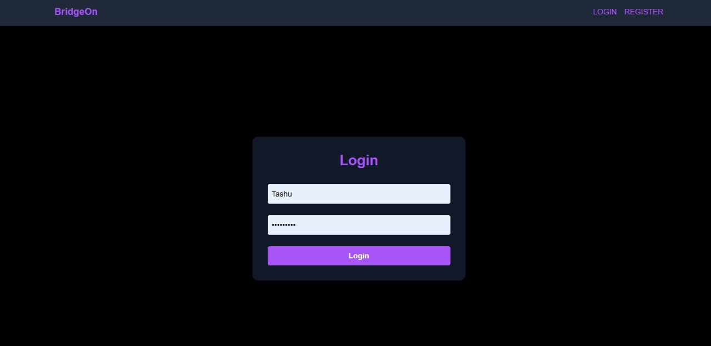
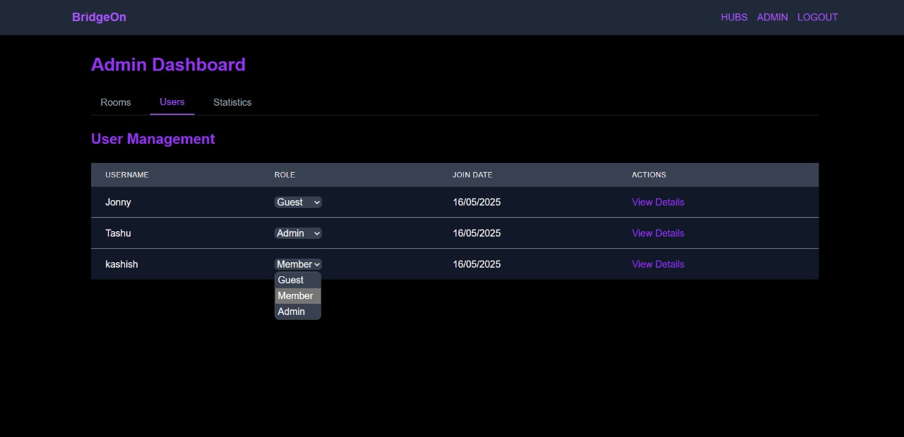
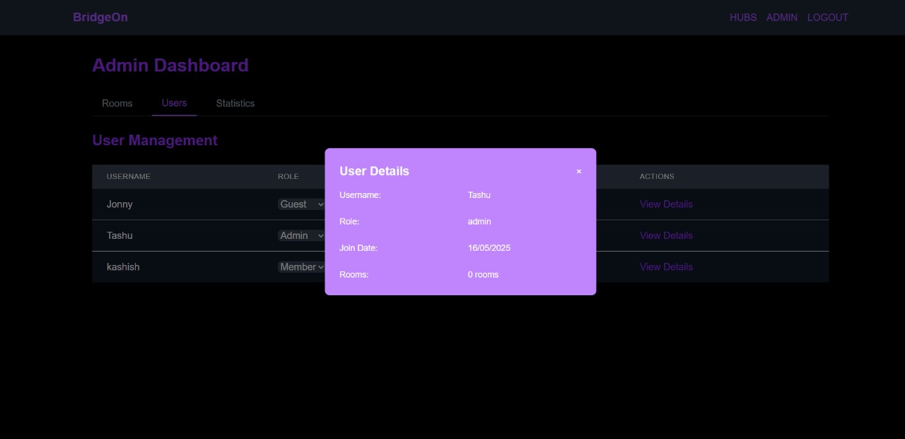
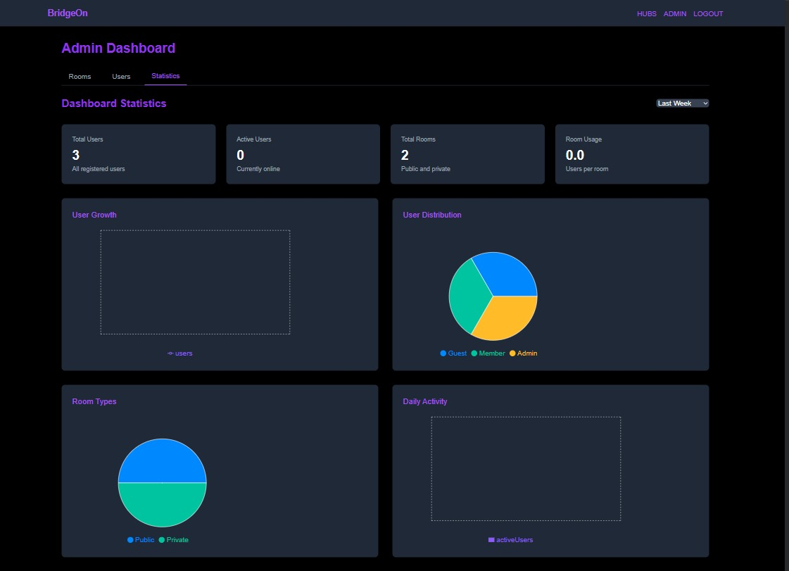

# BridgeOn

## Overview

ConnectON is a real-time communication platform that allows users to join various rooms, chat, and engage in dynamic interactions. The application leverages modern web technologies to provide a seamless and interactive user experience.

## Features

- **User Authentication**: Secure user login using JWT.
- **Room Management**: Users can join or create rooms, including private rooms with password protection.
- **Real-Time Messaging**: Instant messaging within rooms using Socket.io.
- **User Roles**: Differentiation between guests and authenticated users, with role-specific access.
- **Responsive Design**: Frontend built with React, ensuring compatibility across devices.

